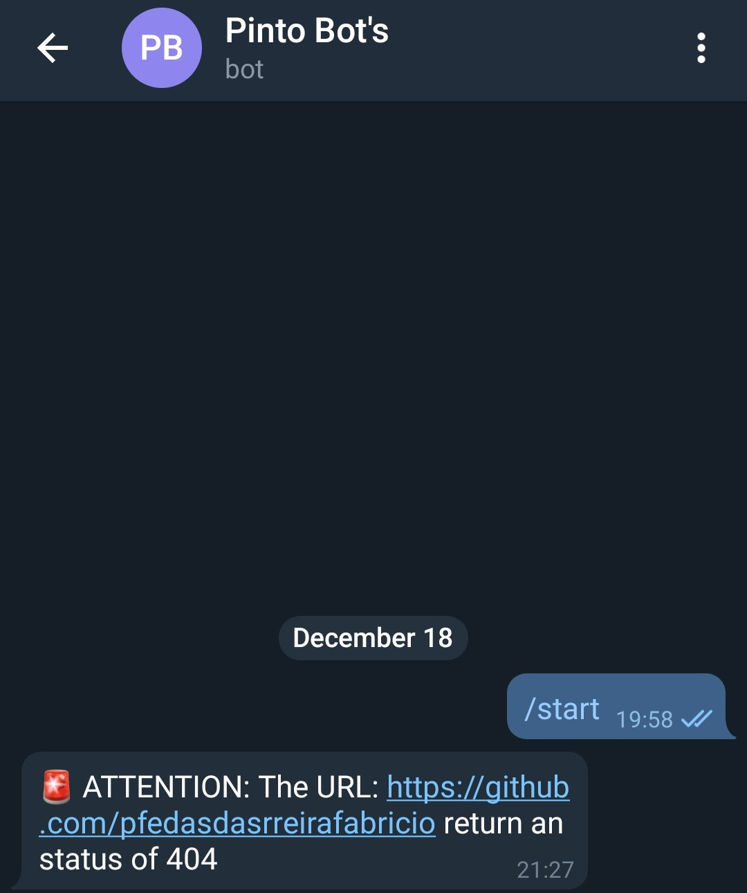

# :incoming_envelope: Telegram Messager

## :eyes: Overview 


## 	:runner: Running

1. Change the file name `.env.example` to `.env`

2. Put your credentials in the `.env` file
```shell
CONF_TELEGRAM_BOT_TOKEN=""
CONF_TELEGRAM_CHAT_ID=0
CONF_CHECK_URL=""
```

4. Install the dependencies
```shell
composer install
```

5. Run the script
```php
php index.php
```

## :page_with_curl: References
- [Bot do Telegram com PHP](https://www.youtube.com/watch?v=zpZr3ek6pks)
